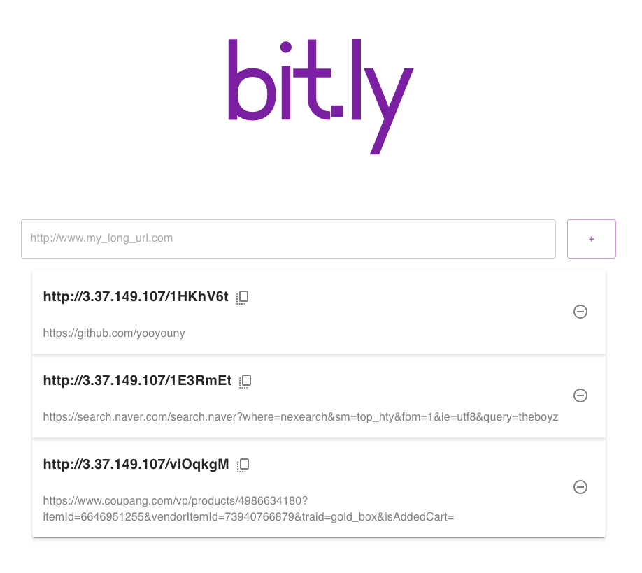
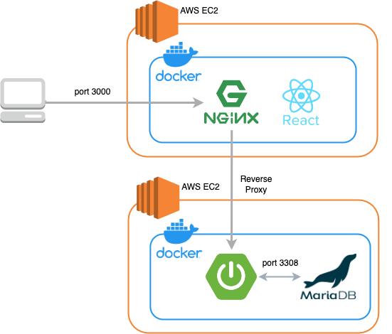
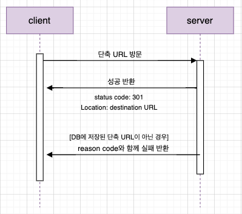

# 💜 bit.ly  

  

🔗 현재 빌링문제로 해당 URL 접속이 일시중단 된 상태입니다. 

본 프로젝트는 Spring Boot와 Java를 공부하며 진행한 토이 프로젝트입니다.  
long URL을 단축시켜주고 본래의 destination으로 redirection해주는 서비스를 제공합니다.   
  

✔️  domain, service, repository 계층별 역할에 집중하여 개발하였습니다.

✔️  library, annotation은 의미와 사용목적을 이해하고 적용하였습니다.

✔️  test code 작성을 통해 코드의 신뢰성을 높였습니다.

✔️  Url 단축에 적합한 base62 인코딩 방식을 적용하였습니다.

✔️  프론트는 react로 구현하였습니다.

✔️  Docker와 AWS를 활용하여 배포하였습니다.
#

### Skill

- Java 11
- Spring Boot
- Spring Data JPA
- Junit 5
- MariaDB
- Gradle
- AWS EC2
- Docker
- IntelliJ IDE
#

### Server Architecture

  
#

### Sequence Diagram

  

